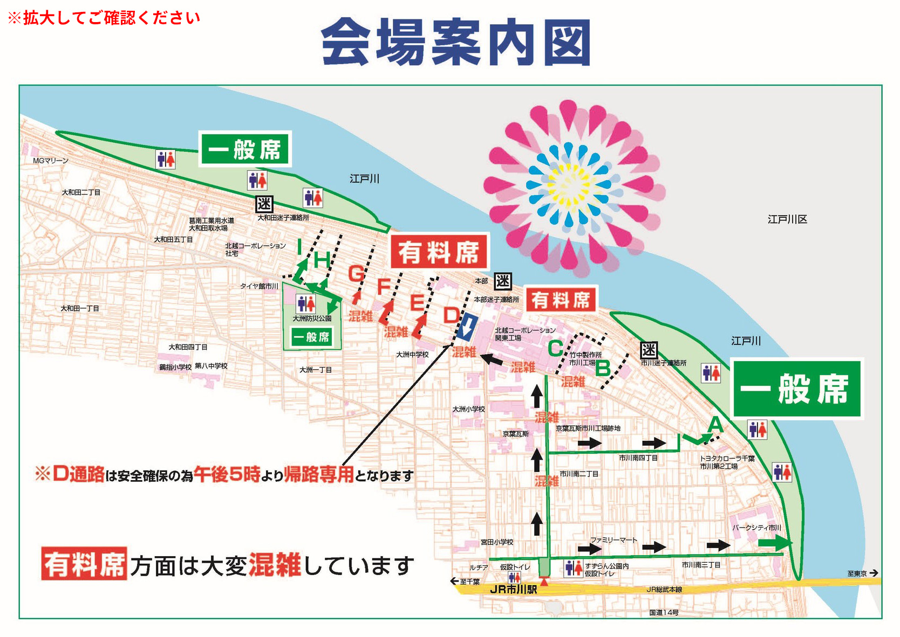

## TL;DR
- 2026년 7/29~8/2 **4박5일·2명**으로 떠나는 일본 시즈오카·도쿄 여름 여행 계획.
- 후지산 포토스팟(시즈오카·도쿄발 버스투어)과 에도가와 불꽃축제 관람이 핵심이며, 아타미 온천·신주쿠·이치카와를 거치는 동선.
- 항공·숙소·일정표·불꽃 회장 안내도·비용·준비물·유의사항을 담는다.

## 목표
- 7/29(수)~8/2(일) **4박5일 시즈오카·도쿄 여름 여행 (후지산 포토스팟 + 에도가와 불꽃축제)
- 시즈오카 1박 → 도쿄(신주쿠) 2박 → 이치카와 1박

## 항공
| 구간 | 항공/편 | 일시 | 비고 |
|------|--------|------|------|
| 가는 편 | 제주항공 1601 | **7/29(수) 07:05 인천(ICN) → 09:00 시즈오카(FSZ)** | 직항 1시간55분 · 무료 위탁 15kg |
| 오는 편 | 제주항공 1102 | **8/2(일) 11:40 도쿄(NRT) → 14:30 인천(ICN)** | 직항 2시간50분 · 무료 위탁 15kg |

## 숙소
| 일정           | 숙소                     |  체크인  | 체크아웃  | 조식         |
| ------------ | ---------------------- | :---: | :---: | ---------- |
| 7/29(수) 시즈오카 | 시즈테츠 호텔 프레지오 시즈오카-에키기타 | 15:00 | 11:00 | 6:30~9:00  |
| 7/30·7/31 도쿄 | 호텔 썬루트 프라자 신주쿠         | 15:00 | 11:00 | 6:30~10:00 |
| 8/1(토) 이치카와  | 이치카와 그랜드 호텔            | 14:00 | 11:00 | 신청 안함      |

## 여행 전 확인
- [x] 제주항공 항공권 예약 확정: **가는 편 1601(7/29) / 오는 편 1102(8/2)** · 무료 위탁 15kg
- [x] Day2 시즈오카 후지 포토 버스투어 예약(시즈오카역 출발)
- [x] Day3 도쿄발 후지산 핵심 버스투어 예약(신주쿠 출발)
- [x] 시즈오카→도쿄 신칸센 좌석(7/30 저녁, 18:56)
- [x] 숙박 예약 확정: 프레지오 시즈오카-에키기타(7/29) / 썬루트 프라자 신주쿠(7/30·7/31) / 이치카와 그랜드 호텔(8/1) · **2인 1실**
- [ ] 에도가와 불꽃축제 2026 정확한 개최일·시간 확인(8/1 토 예상) — 공식: [에도가와구](https://www.city.edogawa.tokyo.jp/hanabi/) / [이치카와(관람 측)](https://www.ichikawa-hanabi.net/)
- [ ] 비짓재팬(입국·세관) 등록
- [ ] 이심
- [ ] 여행자보험

## 일정

| 일자          | 시간            | 장소                                                                                                                                                                        | 비고                                              |
| ----------- | ------------- | ------------------------------------------------------------------------------------------------------------------------------------------------------------------------- | ----------------------------------------------- |
| **7/29(수)** | 07:05 ~ 09:00 | 이동(ICN → 시즈오카)                                                                                                                                                            | 제주항공 1601                                       |
|             | 09:00 ~ 09:45 | 입국 수속, 짐 찾기                                                                                                                                                               |                                                 |
|             | 10:00 ~ 10:50 | 이동(공항 → 시즈오카역)                                                                                                                                                            | 공항 셔틀, 1200엔                                    |
|             | 10:50 ~ 11:10 | 호텔에 캐리어 맡기기                                                                                                                                                               |                                                 |
|             | 11:24 ~ 12:40 | 이동(시즈오카 → 아타미)                                                                                                                                                            | 도카이도 본선                                         |
|             | 12:40 ~ 13:20 | 점심                                                                                                                                                                        | 맥도날드                                            |
|             | 13:20 ~ 13:35 | 버스 이동                                                                                                                                                                     |                                                 |
|             | 13:35 ~ 15:05 | **아타미 로프웨이 + 아타미 성**                                                                                                                                                      | 로프웨이 왕복: 현금 900엔 아타미성: 현금 1100엔              |
|             | 15:05 ~ 15:15 | 도보 이동                                                                                                                                                                     | 코라쿠엔 내                                          |
|             | 15:15 ~ 17:50 | **오션 스파 후아**                                                                                                                                                              |                                                 |
|             | 17:50 ~ 18:10 | 셔틀 이동                                                                                                                                                                     | 16:30 / 17:10 / 17:50 / 18:30                   |
|             | 18:10 ~ 18:55 | 아타미 푸딩                                                                                                                                                                    | 현금 500엔                                         |
|             | 18:55 ~ 20:17 | 이동(아타미 → 시즈오카)                                                                                                                                                            | 도카이도 본선                                         |
|             | 20:17 ~ 20:47 | 호텔 체크인                                                                                                                                                                    |                                                 |
|             | 20:47 ~ 21:50 | 저녁                                                                                                                                                                        | 야키니쿠 라이크                                        |
|             | 21:50 ~       | 숙소                                                                                                                                                                        | 시즈테츠 호텔 프레지오                                    |
| **7/30(목)** | 07:30 ~ 08:00 | 조식                                                                                                                                                                        |                                                 |
|             | 08:00 ~ 08:20 | 짐 맡기기                                                                                                                                                                     |                                                 |
|             | 08:20 ~ 08:40 | 이동(호텔 → 시즈오카역)                                                                                                                                                            | 투어 집합(08:40~08:55)                              |
|             | 08:40 ~ 17:20 | [시즈오카 후지산 포토스팟 버스투어](https://experiences.myrealtrip.com/products/4629323) - 니혼다이라 유메테라스 - 꿈의 대교 - 이온몰 후지노미야(점심) - 후지산 세계유산센터 - 센겐대사 - 시라이토 폭포 - 타누키호 |                                                 |
|             | 17:20 ~ 18:35 | 짐 찾기                                                                                                                                                                      |                                                 |
|             | 18:35 ~ 18:56 | 에키벤 구입                                                                                                                                                                    | 도카이켄                                            |
|             | 18:56 ~ 20:18 | 이동(시즈오카 → 도쿄) - 저녁: 에키벤                                                                                                                                                | 신칸센                                             |
|             | 20:18 ~ 20:40 | **도쿄역 마루노우치 역사 라이트업**                                                                                                                                                     | 21:00 소등                                        |
|             | 20:40 ~ 21:00 | 이동(도쿄역 → 신주쿠)                                                                                                                                                             | 주오선/야마노테선                                       |
|             | 21:00 ~       | 숙소                                                                                                                                                                        | 호텔 썬루트 프라자 신주쿠                                  |
| **7/31(금)** | 07:00 ~ 07:40 | 조식                                                                                                                                                                        |                                                 |
|             | 07:50 ~ 08:10 | 이동(호텔 → 신주쿠 MODE학원 앞)                                                                                                                                                     | 투어 집합 08:10                                     |
|             | 08:10 ~ 18:00 | [도쿄발 후지산 핵심 버스투어](https://experiences.myrealtrip.com/products/5815645) - 아라쿠라야마 센겐공원 - 히카와 시계점 - 오시노핫카이 - 가와구치코 로손 - 오이시 공원                                |                                                 |
|             | 18:00 ~ 18:40 | 이동(신주쿠 → 롯폰기 힐스)                                                                                                                                                          | 오에도선                                            |
|             | 18:40 ~ 20:00 | **도쿄 시티뷰 & 스카이덱**                                                                                                                                                         | 일몰: 18:44 입장 시간: ~19:30                      |
|             | 20:00 ~ 21:00 | 저녁                                                                                                                                                                        |                                                 |
|             | 21:00 ~ 21:25 | 이동(롯폰기 → 四谷三丁目)                                                                                                                                                           | 히비야선→마루노우치선 환승, 약 20분                           |
|             | 21:25 ~ 21:55 | **너의이름은 계단 (스가 신사 男坂)**                                                                                                                                                   | 四谷三丁目역 도보 7분, 붉은 난간 계단, 야간 상시 개방(경내 참배는 17시 마감) |
|             | 21:55 ~ 22:10 | 이동(四谷三丁目 → 신주쿠)                                                                                                                                                           | 마루노우치선 약 5분                                     |
|             | 22:10 ~       | 숙소                                                                                                                                                                        | 호텔 썬루트 프라자 신주쿠                                  |
| **8/1(토)**  | 07:00 ~ 07:40 | 조식                                                                                                                                                                        | 이른 조식                                           |
|             | 07:40 ~ 08:00 | 체크아웃                                                                                                                                                                      |                                                 |
|             | 08:00 ~ 08:20 | 이동(신주쿠 → 오테마치)                                                                                                                                                            | 마루노우치선, 약 18분                                   |
|             | 08:20 ~ 08:35 | 오테마치역 코인로커 짐 보관, 도보(→키쿄몬)                                                                                                                                                 | 키쿄몬 도보 약 5분                                     |
|             | 08:35 ~ 10:00 | 황궁 정리권 수령, 대기                                                                                                                                                             | 키쿄몬 앞, 09:00 배부(선착순 300명), 여권 지참                |
|             | 10:00 ~ 11:15 | **황궁 일반참관**                                                                                                                                                               | 약 1시간15분, 한국어 음성가이드 앱                           |
|             | 11:15 ~ 11:45 | 짐 회수, 이동(오테마치 → 기요스미시라카와)                                                                                                                                                 | 한조몬선, 약 8분                                      |
|             | 11:45 ~ 12:00 | 기요스미시라카와역 코인로커 짐 보관                                                                                                                                                       |                                                 |
|             | 12:00 ~ 13:00 | 점심                                                                                                                                                                        | 기요스미시라카와                                        |
|             | 13:00 ~ 15:00 | 기요스미시라카와 산책                                                                                                                                                               | 기요스미 정원(150엔)                                   |
|             | 15:00 ~ 15:15 | 짐 회수                                                                                                                                                                      |                                                 |
|             | 15:15 ~ 16:00 | 이동(기요스미시라카와 → 이치카와)                                                                                                                                                       | 한조몬선→킨시초 환승 JR 소부선, 약 30분                       |
|             | 16:00 ~ 16:20 | 이치카와 그랜드 호텔 체크인                                                                                                                                                           | 교통규제 17:00 전 도착                                 |
|             | 16:30 ~ 17:00 | 저녁(이른 저녁)                                                                                                                                                                 |                                                 |
|             | 17:30 ~ 19:00 | 자리 잡기                                                                                                                                                                     | A통로(市川南 무료석)                                    |
|             | 19:15 ~ 20:30 | **에도가와 불꽃축제**                                                                                                                                                             |                                                 |
|             | 20:30 ~ 21:30 | 도보 이동                                                                                                                                                                     |                                                 |
|             | 21:30 ~       | 숙소                                                                                                                                                                        | 이치카와 그랜드 호텔                                     |
| **8/2(일)**  | 07:30 ~ 08:10 | 아침                                                                                                                                                                        | 편의점에서 미리 사기                                     |
|             | 08:10 ~ 08:30 | 체크아웃                                                                                                                                                                      |                                                 |
|             | 08:30 ~ 09:40 | 이동(이치카와 → 나리타공항)                                                                                                                                                          |                                                 |
|             | 09:40 ~ 11:40 | 공항 수속 및 탑승                                                                                                                                                                |                                                 |
|             | 11:40 ~ 14:30 | 이동(도쿄 → 인천)                                                                                                                                                               | 제주항공 1102                                       |
|             | 14:30 ~       | 인천 도착                                                                                                                                                                     |                                                 |

## 에도가와 불꽃 회장 안내도 (이치카와 측)

> 🟩 무료석(一般席) · 🟥 유료석(有料席) · 통로(A~I) 표시.
> - **A통로 = 동쪽 무료석(市川南·파크시티, JR 市川駅 최근접)** → 호텔서 가장 가까운 무료 관람 동선
> - **D통로 = 오후 5시부터 귀로(귀가) 전용** (갈 때 사용 불가)
> - 유료석 방면은 "매우 혼잡(大変混雑)" 경고 / 곳곳에 迷(미아 안내소)·화장실 표시
> - (출처: CN플레이가이드 회장안내도 · 2026 정확 배치는 공식 발표본 재확인)

## 준비물

## 신경써야 할 부분
- **요일:** 7/29(수)·7/30(목)·7/31(금)·8/1(토)·8/2(일).
- **항공 양편 제주항공(LCC)** — 무료 위탁수하물 1인 15kg 포함(1601/1102). 15kg 초과 시 추가요금.
- **시즈오카 공항(FSZ)은 시내에서 멀다** — 시즈오카역까지 공항버스 약 50분. 7/29 도착(09:00) 후 이동시간 여유를 둘 것.
- **Day2 투어는 시즈오카역 08:40~08:55 집합** → 7/29 숙소(프레지오 시즈오카-에키기타)가 시즈오카역 인근이라 아침 이동 편함.
- **신칸센(시즈오카→도쿄)은 7/30 투어 종료 후 18:56 탑승** — 좌석 미리 예약. 짐은 투어 전 시즈오카역 코인로커 활용. 도착(도쿄역 20:18) 후 역사 라이트업(~21시)까지 가능.
- **Day3 도쿄발 투어는 신주쿠 MODE학원 앞 08:10 집합** → 신주쿠 숙소(썬루트 프라자 신주쿠)에서 도보로 집합 가능해 편리.
- **8/1 숙소 이동:** 오전에 신주쿠 체크아웃 → 이치카와 그랜드 호텔로 이동(짐 맡기기). 무거운 짐 이동 동선 고려.
- **8/1 불꽃은 이치카와 측에서 관람(호텔 위치 최적)** — 이치카와 그랜드 호텔은 **JR 市川駅 북구 도보 3분**, 이치카와 측 강변 회장(市川南)은 **市川駅 남구 도보 약 15분**. 호텔↔회장 **도보 약 15~20분**으로 걸어서 관람·복귀 가능 → 市川역 입장규제 회피. 무료석은 A통로(동쪽 市川南), D통로는 17시부터 귀로 전용. 자리는 16:30~17:00까지 확보.
- **귀국편이 나리타(NRT) 11:40 출발(제주항공 1102)** — 8/2 오전 일찍 이동 필요(2시간 전 ~09:40 도착 기준). 이치카와가 나리타 방향이라 접근은 가까운 편.
- **두 버스투어 모두 점심 불포함(자유식)** — 투어 중 점심 시간·비용 별도.
- 미정 일정(시즈오카 관광·8/1 도쿄/이치카와 관광)은 위 표의 `(미정·가상)` 행에 장소를 채워 확정.

---

*헤더 이미지: Jezael Melgoza / Unsplash (Unsplash License) — [출처](https://unsplash.com/photos/people-gathered-outside-buildings-and-vehicles-alY6_OpdwRQ)*
