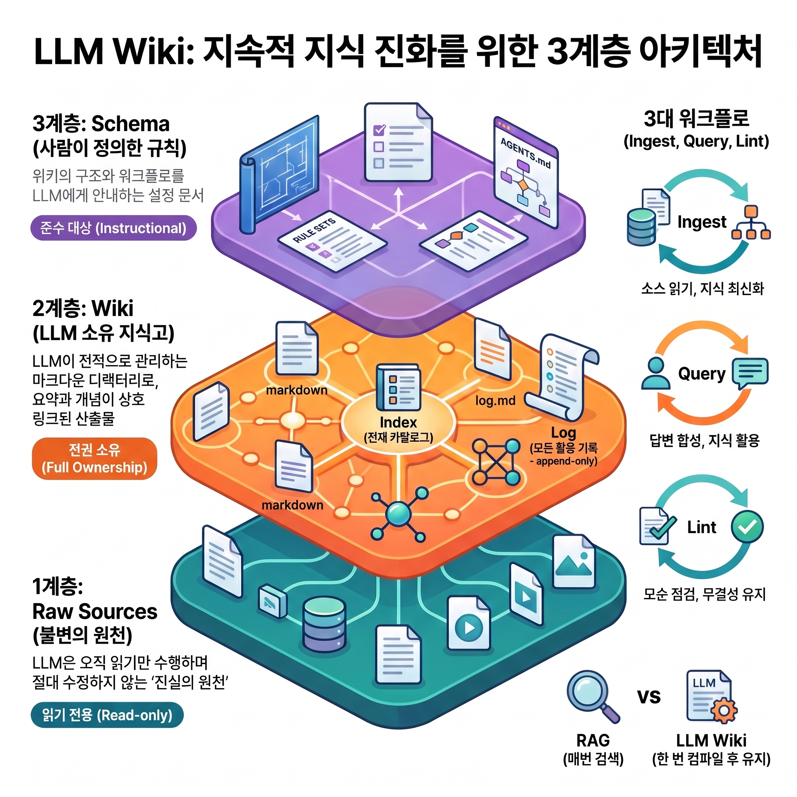
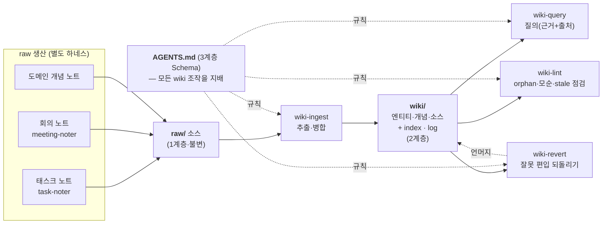

## TL;DR
- **개요**: 흩어진 개인·업무 노트(태스크·회의·도메인)를 LLM이 정제·연결한 **지식 베이스(wiki)** 로 통합하는 시스템을, Claude Code **하네스**(스킬·에이전트·스키마)로 구현한 사례다.
- **바탕 패턴**: Andrej Karpathy의 LLM Wiki 패턴이다. 쿼리마다 원본을 검색하는 RAG와 달리, LLM이 **수집 시점에 한 번 정제·상호링크된 완결 페이지로 컴파일**해두고 이를 참조한다(compile-once-keep-current).
- **동기**: "노트를 잘 쓰는 것"과 "그 지식을 잘 꺼내 쓰는 것"은 별개의 문제다. 소스가 축적될수록 지식이 **복리로** 쌓이도록 만드는 것이 목표다.
- **현황**: raw 소스를 ingest하여 **wiki 551페이지**(엔티티 209·개념 163·소스 179)로 성장했으며, 지식 유입·정제·질의·유지 파이프라인이 가동 중이다.

## 1. 배경 · 문제

업무 과정에서 태스크 분석, 회의록, 도메인 정리, 코드 패턴 등 노트가 지속적으로 축적된다. 그러나 다음과 같은 한계가 있다.

- **같은 주제가 여러 문서에 분산된다.** 물류 시스템·`가용재고`·특정 과제 등의 내용이 태스크 14건·회의 7건·개념 노트 곳곳에 조각으로 존재한다.
- **"~에 대해 아는 것을 모두 모아 달라"는 요청이 불가능하다.** 파일을 하나씩 열어 확인해야 한다.
- **중복·모순이 방치된다.** 동일 개념이 문서마다 다르게 서술된다.

> **핵심 문제**
> **노트를 잘 쓰는 것 ≠ 그 지식을 잘 꺼내 쓰는 것.** 이 간극을 해소하는 것이 목표다.

## 2. LLM Wiki란 — 3계층 · 3워크플로

Andrej Karpathy가 2026년 4월 GitHub Gist로 제안한 지식 베이스 패턴이다. **원천 문서를 잘게 검색(RAG)하는 대신, LLM이 수집 시점에 정제·중복제거·상호연결된 완결 페이지로 컴파일**해두고 이를 참조한다. 질문 이전에 상호참조와 모순 표시까지 완성되므로, 위키는 일회성 검색 결과가 아니라 **영속적·누적되는 산출물**이 된다. 개념의 상세 정리는 LLM Wiki 노트를 참조한다.

### 2-1. 3계층 — 권한이 구분된 세 층

패턴의 골격은 **소유·권한이 명확히 구분된 세 계층**이다.

| 계층 | 이름 | 경로 | 소유·권한 | 역할 |
|---|---|---|---|---|
| **1계층** | Raw Sources | `raw/` | LLM은 **읽기 전용** | 불변(immutable) 진실의 원천. wiki가 틀리면 원본이 아니라 wiki를 재생성한다 |
| **2계층** | Wiki | `wiki/` | LLM이 **전적으로 소유** | 정제·상호링크된 마크다운 지식 페이지(생성물) |
| **3계층** | Schema | `AGENTS.md` | 사람이 정의, LLM이 준수 | wiki의 생성·병합·유지 규칙(단일 진실 공급원) |

- **안전장치**: "sources는 읽기만, wiki 폴더만 생성·수정" 원칙에 따라 기존 볼트에 적용해도 원본이 오염되지 않는다.
- 스키마 파일명은 도구별로 다르다. Claude Code는 `CLAUDE.md`, Codex는 `AGENTS.md`를 사용하며, 본 볼트는 `AGENTS.md`를 스키마로 채택했다.

### 2-2. wiki 페이지 3종 — 2계층의 산출물

- **엔티티(entity)**: 고유명사 — 인물·조직·프로젝트·제품·시스템. 예) 물류 시스템
- **개념(concept)**: 도메인 용어·이론·방법. 예) `가용재고`·특정 과제
- **소스(source)**: 원본 하나당 요약 페이지. 어느 원본에서 무엇이 도출됐는지 추적하고, `contentHash`로 변경을 감지하여 **되돌리기(revert)의 근거**가 된다.
- 페이지는 `양방향 링크`로 연결되어 **지식 그래프**를 이룬다.

### 2-3. 카탈로그 · 기록 — index.md / log.md

- **`index.md`**: 전체 엔티티·개념 목록과 aliases. 질의 시 방대한 wiki 중 **어디를 열지 먼저 결정하는 진입점**(컨텍스트 라우터)이며, 매 작업마다 갱신된다.
- **`log.md`**: 모든 수집·질의·점검·되돌리기를 append-only로 기록하여 "언제 무엇이 왜 편입·제거됐는지" 감사 추적을 제공하며, 되돌리기의 근거가 된다.

### 2-4. 3워크플로 — 지식의 생애주기

- **Ingest(수집)**: 원본을 읽어 엔티티·개념·모순을 추출하고 페이지를 생성·병합하며 `index.md`·`log.md`를 갱신한다. **복사가 아닌 병합**(append-only)으로, 동일 개념은 여러 소스가 한 페이지에 누적된다.
- **Query(질의)**: index→페이지→링크로 구조를 탐색하여 답과 `출처`를 제시한다. 근거가 없으면 "wiki에 없음"으로 명시하며, 가치 높은 답변은 새 페이지로 편입한다.
- **Lint(점검)**: orphan(고립)·stale(90일 미갱신)·깨진 링크·모순·태그 위반을 점검하여 무결성을 유지한다.
- **Revert(되돌리기)**: 잘못 편입되거나 원본이 이동·삭제된 경우 해당 소스의 기여분만 언머지한다. Karpathy 원본에는 없는, 본 구현에서 추가한 오퍼레이션이다.

> **품질을 지키는 규칙**
> **append-only 병합**(덮어쓰기 금지) · **verbatim 인용**(출처를 원문 그대로 — 검증·되돌리기 근거) · **모순 보존**(충돌은 은폐하지 않고 `## 모순`에 양측 보존) · **contentHash**(본문 미변경 시 재수집에서 즉시 skip).

## 3. LLM Wiki vs RAG

두 접근의 본질적 차이는 **합성(synthesis)이 언제 일어나는가**에 있다. LLM Wiki는 비용을 "질문 시점"에서 "수집 시점"으로 이동시킨다.

| 관점          | LLM Wiki                   | 전통적 RAG                        |
| ----------- | -------------------------- | ------------------------------ |
| **합성 시점**   | 수집 시 **한 번**(compile-once) | **매 쿼리마다**(retrieve-per-query) |
| **상태**      | stateful — 누적되는 영속 산출물     | stateless — 매 질문이 새 출발         |
| **검색 대상**   | 미리 정제한 **완결 페이지**          | 원본을 쪼갠 **임베딩 청크**              |
| **탐색 방식**   | index→페이지→링크(구조 탐색)        | 벡터 유사도                         |
| **문서 간 관계** | 사전 컴파일된 상호참조·모순 표시         | 쿼리 시점에 관계 이해 없음                |
| **결과 품질**   | 중복제거·출처추적·모순보존             | 노이즈·중복·청크 경계 오류 가능             |

**트레이드오프**: 합성이 수집 시점에 baked-in되므로 **수집 시점의 오독이 그 페이지에서 도출되는 모든 답변에 내장**된다(RAG는 매 쿼리 원본을 다시 읽는다). 따라서 `lint`·`revert`로 오류를 교정하는 유지 루프가 필수다.

> **선택 기준**
> - **LLM Wiki** — 경계가 있는 도메인, 수백 소스 규모, 추적성이 중요하고 갱신이 잦지 않은 경우. (본 사례가 해당)
> - **RAG** — 대규모·실시간·비정형 코퍼스, 초저지연 검색이 필요한 경우.
> - 실무에서는 **결합**된다. RAG는 대규모 롱테일 검색, LLM Wiki는 컴파일된 도메인 전문성을 담당한다. 정량적 규모·지연·비용 임계치는 신뢰할 벤치마크가 부재하여 LLM Wiki 노트에서 "미확인"으로 다룬다.

## 4. 아키텍처 — 데이터 흐름

raw 소스가 ingest를 거쳐 wiki로 편입되고, wiki를 대상으로 질의·점검·되돌리기가 순환한다. 스키마(`AGENTS.md`)가 모든 wiki 조작을 지배한다.

- **단방향 병합**: ingest는 wiki로만 쓰며, raw는 절대 수정하지 않는다.
- **유지 루프**: query·lint·revert는 모두 wiki를 대상으로 순환하며, 스키마가 이 조작들을 규율한다.
- raw 생산 하네스(task-noter·meeting-noter 등)는 **LLM Wiki 외부의 별도 하네스**로, 소스를 공급하는 역할만 한다(§5).

## 5. 적용 · 활용

LLM Wiki 위에 **지식을 생산하는 하네스**들을 결합했다. 이들이 raw 소스를 생산하면 LLM Wiki가 wiki로 정제한다.

| 유입 하네스 | 역할 | 현황 |
|---|---|---|
| **Task-Note** | JIRA·OSS·PR·리뷰를 취합해 태스크 노트로 저작 | 14건 |
| **Meeting-Note** | 회의 녹음·전사를 회의 노트로 정제 (+ Works 캘린더로 참석자 융합) | 7건 |
| **Concept(도메인 개념)** | 에픽·문서에서 도메인 개념을 개별 문서로 축적 | 10건 |

### 예시 흐름
1. 로컬 녹음에서 전사(`transcript.txt`) 생성
2. `meeting-noter`가 회의 노트로 정제하고, **Works 캘린더와 융합**하여 참석자·일시를 보완
3. `wiki-ingest`가 회의 노트를 wiki로 편입하며 기존 개념 페이지에 **병합**
4. 이후 해당 주제를 질의하면 `wiki-query`가 **연결된 지식 페이지와 출처**로 응답

> **Before → After**
> **Before**: `가용재고` 지식이 태스크 3건 + 회의 1건 + 개념 노트에 분산 → 전부 열람해야 함
> **After**: `wiki/concepts/가용재고.md` 한 페이지에 정의·특징·코드표현(재고 테이블)·출처가 누적 → 단번에 파악

## 6. 효과 · 한계

**효과**
- 크로스소스 종합 — 소스가 늘수록 페이지가 두꺼워진다(복리 효과)
- 출처 추적·모순 보존·저비용 재수집(해시 비교)
- 질의 시 **사내 도메인 맥락에 부합하는 답변** — 웹·일반 지식보다 정확

**한계 / 적합 조건**
- **경계가 있는 도메인 + 수백 소스 규모**에 적합하다(본 사례가 해당).
- 대규모·실시간·비정형 코퍼스에는 여전히 RAG가 적합하다.
- 정제(ingest)에 선불 비용이 발생하므로, 중복이 적은 소수 문서에는 과도하다.
- 수집 시점의 오독이 답변에 내장되므로 `lint`·`revert` 유지 루프가 필수다.

## 7. 참고

- LLM Wiki — 패턴 개념·구현체 비교·트렌드 정리(1차 출처 검증)
- LLM Wiki 실습 가이드 — 설치·구성·운영
- Andrej Karpathy — 패턴 제안자 / RAG · GraphRAG — 비교 대상
- **Karpathy LLM Wiki (원본 gist)**: <https://gist.github.com/karpathy/442a6bf555914893e9891c11519de94f>

---

*헤더 이미지: Bernd 📷 Dittrich / Unsplash (Unsplash License) — [출처](https://unsplash.com/photos/a-white-board-with-writing-written-on-it-1xE5QnNXJH0)*
