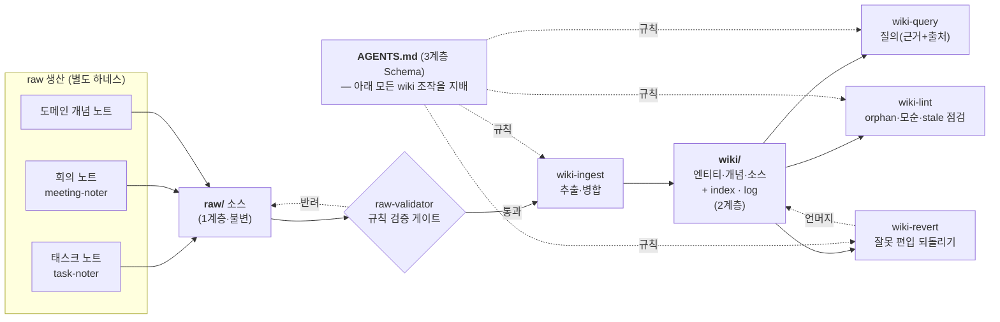
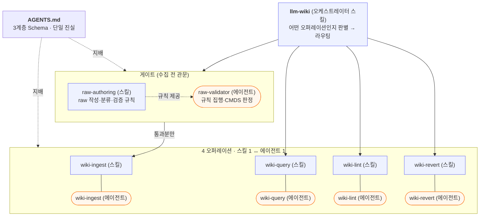

## TL;DR
- **무엇을**: 흩어진 개인·업무 노트(태스크·회의·도메인)를 LLM이 정제·연결한 **지식 베이스(wiki)** 로 자동 합치는 시스템을, Claude Code **하네스**(스킬+에이전트+스키마)로 구현한 사례다.
- **바탕 패턴**: Andrej Karpathy의 LLM Wiki 패턴 — 쿼리마다 원본을 검색하는 RAG 대신, LLM이 **수집 시점에 한 번 정제·상호링크된 완결 페이지로 컴파일**해두고 참조한다(compile-once-keep-current).
- **왜**: "노트를 잘 쓰는 것"과 "그 지식을 잘 꺼내 쓰는 것"은 다른 문제다. 소스가 쌓일수록 지식이 **복리로** 축적되게 만들기 위해서.
- **현재 상태**: raw 소스 → ingest → **wiki 551페이지**(엔티티 209·개념 163·소스 179)로 성장. LLM Wiki 하네스 = 스킬 6·에이전트 5, 지식 유입·정제·질의·유지 파이프라인 가동 중.

## 1. 배경 · 문제

일하면서 노트는 계속 쌓인다. 태스크 분석, 회의록, 도메인 정리, 코드 패턴… 그런데:

- **같은 주제가 여러 문서에 흩어진다** — 물류 시스템·`가용재고`·특정 과제 등의 얘기가 태스크 14개·회의 7개·개념 노트 곳곳에 조각으로 존재
- **"~에 대해 아는 걸 다 모아줘"가 안 된다** — 파일을 하나씩 열어봐야 함
- **중복·모순이 방치된다** — 같은 개념을 문서마다 다르게 서술

> **한 줄 문제**
> **노트를 잘 쓰는 것 ≠ 그 지식을 잘 꺼내 쓰는 것.** 이 간극을 메우는 게 목표다.

## 2. LLM Wiki란 — 3계층 · 3워크플로

Andrej Karpathy가 2026년 4월 GitHub Gist로 제안한 지식 베이스 패턴. **원천 문서를 잘게 검색(RAG)하는 대신, LLM이 수집 시점에 정제·중복제거·상호연결된 "완결된 페이지"로 컴파일**해두고 그걸 참조한다. 질문이 들어오기 전에 이미 상호참조와 모순 표시까지 만들어져 있어, 위키는 일회성 검색 결과가 아니라 **영속적·누적되는 산출물**이 된다. 개념 원문 정리는 LLM Wiki 노트를 참고.


### 2-1. 3계층 — 권한이 다른 세 층

패턴의 골격은 **소유·권한이 뚜렷이 다른 세 계층**이다.

| 계층 | 이름 | 경로 | 소유·권한 | 역할 |
|---|---|---|---|---|
| **1계층** | Raw Sources | `raw/` | LLM은 **읽기만** | 불변(immutable) 진실의 원천. wiki가 틀리면 원본이 아니라 wiki를 다시 만든다 |
| **2계층** | Wiki | `wiki/` | LLM이 **전적으로 소유** | 정제·상호링크된 마크다운 지식 페이지(생성물) |
| **3계층** | Schema | `AGENTS.md` | 사람이 정의, LLM이 따름 | wiki를 어떻게 생성·병합·유지할지 규칙(단일 진실 공급원) |

- **핵심 안전장치**: "sources는 읽기만, wiki 폴더만 생성/수정" 원칙 덕에 기존 볼트에 얹어도 원본이 오염되지 않는다.
- 도구별로 스키마 파일명이 다르다 — Claude Code는 `CLAUDE.md`, Codex는 `AGENTS.md`. 이 볼트는 `AGENTS.md`를 스키마로 쓴다.

### 2-2. wiki 페이지 3종 — 2계층의 산출물

- **엔티티(entity)**: 고유명사 — 인물·조직·프로젝트·제품·시스템. 예: 물류 시스템
- **개념(concept)**: 도메인 용어·이론·방법. 예: `가용재고`·특정 과제
- **소스(source)**: 원본 하나당 요약 페이지. 어느 원본에서 무엇이 나왔는지 추적 + `contentHash`로 변경 감지 → **되돌리기(revert)의 근거**
- 페이지끼리 `양방향 링크`로 이어져 **지식 그래프**를 이룬다.

### 2-3. 카탈로그·기록 — index.md / log.md

- **`index.md`**: 전체 엔티티·개념 목록 + aliases. 질의 시 방대한 wiki 중 **어디를 열지 먼저 정하는 진입점**(컨텍스트 라우터). 매 작업마다 갱신.
- **`log.md`**: 모든 수집·질의·점검·되돌리기를 append-only로 기록 — "언제 무엇이 왜 편입/제거됐나" 감사 추적. 되돌리기의 근거이기도 하다.

### 2-4. 3워크플로 — 지식의 생애주기

- **Ingest(수집)**: 원본 읽기 → 엔티티·개념·모순 추출 → 페이지 생성/병합 + `index.md` 갱신 + `log.md` 기록. **복사가 아니라 병합**(append-only) — 같은 개념은 여러 소스가 한 페이지에 누적된다. 소스 하나가 여러 페이지를 건드릴 수 있다.
- **Query(질의)**: index→페이지→링크로 구조 탐색해 답 + `출처`. 없으면 "wiki에 없음"이라고 정직하게. 가치 높은 답변은 새 페이지로 편입.
- **Lint(점검)**: orphan(고립)·stale(90일 미갱신)·깨진 링크·모순·태그 위반을 점검해 무결성 유지.
- **Revert(되돌리기, 구현 확장)**: 잘못 편입되거나 원본이 이동·삭제됐을 때, 그 소스의 기여분만 언머지. Karpathy 원본엔 없고 이 구현에서 추가한 오퍼레이션.

> **품질을 지키는 규칙**
> **append-only 병합**(덮어쓰기 금지) · **verbatim 인용**(출처 원문 그대로 — 검증·되돌리기 근거) · **모순 보존**(충돌은 숨기지 않고 `## 모순`에 양측 보존) · **contentHash**(본문 안 바뀌면 재수집 시 즉시 skip).

## 3. LLM Wiki vs RAG

두 접근의 본질적 차이는 **언제 합성(synthesis)이 일어나는가**다. LLM Wiki는 비용을 "질문 시점"에서 "수집 시점"으로 옮긴다.

| 관점          | LLM Wiki                   | 전통적 RAG                        |
| ----------- | -------------------------- | ------------------------------ |
| **합성 시점**   | 수집 시 **한 번**(compile-once) | **매 쿼리마다**(retrieve-per-query) |
| **상태**      | stateful — 누적되는 영속 산출물     | stateless — 매 질문이 새 출발         |
| **검색 대상**   | 미리 정제한 **완결 페이지**          | 원본을 쪼갠 **임베딩 청크**              |
| **탐색 방식**   | index→페이지→링크(구조 탐색)        | 벡터 유사도                         |
| **문서 간 관계** | 사전 컴파일된 상호참조·모순 표시         | 쿼리 시점에 관계 이해 없음                |
| **결과 품질**   | 중복제거·출처추적·모순보존             | 노이즈·중복·청크 경계 오류 가능             |

**트레이드오프**: 합성이 수집 시점에 baked-in되므로, **수집 시점의 오독이 그 페이지에서 나오는 모든 답변에 내장**된다(RAG는 매 쿼리 원본을 다시 읽는다). 그래서 `lint`·`revert`로 잘못을 잡아내는 유지 루프가 필수다.

> **언제 무엇을 쓰나**
> - **LLM Wiki** — 경계 있는 도메인 + 수백 소스 규모, 추적성이 중요, 갱신이 잦지 않을 때. (우리 케이스가 여기)
> - **RAG** — 대규모·실시간·비정형 코퍼스, 초저지연 검색이 필요할 때.
> - 실무에선 **결합**된다: RAG=대규모 롱테일 검색, LLM Wiki=컴파일된 도메인 전문성. 정량 규모·지연·비용 임계치는 아직 신뢰할 벤치마크가 없어 LLM Wiki 노트에서 "미확인"으로 다룬다.

## 4. 디렉토리 구조

이 볼트는 3계층을 폴더 경계로 그대로 구현했다. 각 레이어의 ingest 대상 여부가 명확히 갈린다.

```
CMDS_yjs/
├── AGENTS.md            # 3계층 Schema — wiki 생성·병합·유지 규칙(단일 진실)
├── raw/                 # 1계층 Raw Sources — 불변, ingest ✅ 대상
│   ├── 00. Journal/     #   (Daily/Monthly 로그는 ingest 제외)
│   ├── 10. Sources/     #   회의·클리핑 등 원본 + Attachments/
│   ├── 20. Notes/       #   태스크·회의·도메인 개념 노트 (주 ingest 소스)
│   ├── 30. People/
│   └── 40. CMDS/        #   분류 체계(MOC) — 📚 접두사는 ingest 제외
├── wiki/                # 2계층 Wiki — LLM 생성물, 재수집 ❌ (자기 출력물)
│   ├── index.md         #   전체 카탈로그(컨텍스트 라우터)
│   ├── log.md           #   append-only 작업 기록
│   ├── entities/        #   엔티티 209
│   ├── concepts/        #   개념 163
│   └── sources/         #   소스 179
└── infra/               # 옵시디언 설정·템플릿·스크립트 — ingest ❌
```

> **ingest 스코프(allowlist)**
> - **source = `raw/` 하위 문서만.** wiki·infra·dotfolder(`.obsidian`·`.trash` 등)는 **어떤 경우에도 ingest 안 함**(자기 출력물 재수집·설정 오염 방지).
> - raw 안이라도 **MOC/인덱스**(`📖`·`📚`·`🏛`·`_` 접두사)·**Daily/Monthly 로그**·**빈 문서/스텁**은 제외.

## 5. 아키텍처 — 데이터 흐름

raw 소스가 게이트를 지나 wiki로 편입되고, wiki를 대상으로 질의·점검·되돌리기가 돈다.



- **게이트**: 모든 raw는 `raw-validator`가 규칙 적합성·CMDS 분류를 판정한 뒤에만 ingest된다.
- **병합 방향**: ingest는 wiki로 단방향으로만 쓴다. raw는 절대 수정하지 않는다.
- **유지 루프**: query·lint·revert는 모두 wiki를 대상으로 돌며, 스키마(AGENTS.md)가 이 조작들을 지배한다.
- raw 생산 하네스(task-noter·meeting-noter 등)는 **LLM Wiki 밖의 별도 하네스**로, 소스를 공급할 뿐이다(§7).

## 6. 구현 — 하네스 구성 (스킬 · 에이전트)

각 오퍼레이션을 **스킬(어떻게 — 절차·규칙) + 에이전트(누가 — 실행 주체)** 로 분리했다. 반복·재사용 가능하고, 다음 세션에서도 description 키워드로 자동 트리거된다(=하네스로 구현). 아래는 **LLM Wiki에 직접 속한 구성요소만** 표현한 것이다.



### 스킬 (6)

| 스킬 | 역할 | 트리거 예 |
|---|---|---|
| `raw-authoring` | raw 문서의 작성·분류(CMDS)·검증 규칙 — 프론트매터·TL;DR·위키링크·명명·태그. 수집 전 품질 기준의 단일 진실 | "이 문서 규칙에 맞아?", "raw 검증" |
| `wiki-ingest` | 검증 통과 raw를 entity·concept·source 페이지로 변환·병합하고 index·log 갱신. 원본 raw 불변 | "ingest 해줘", "위키에 수집" |
| `wiki-query` | index를 라우터로 관련 페이지만 로드·링크 추적해 질의에 답(출처 명시). 가치 있으면 새 페이지로 편입 | "wiki에서 찾아줘", "wiki 기반 답" |
| `wiki-lint` | orphan·stale·모순·missing 링크·태그/스키마 위반 검출·수정 제안. touched만/전체 점검 | "wiki 점검", "깨진 링크 찾아줘" |
| `wiki-revert` | 잘못 수집된 source의 ingest를 log 기반으로 되돌림(생성 페이지 삭제+병합 언머지). 파괴적→대상 확인 후 | "ingest 취소", "이 source 빼줘" |
| `llm-wiki` | 위 오퍼레이션을 엮는 **오케스트레이터**. 어떤 작업이 필요한지 판별해 개별 스킬로 라우팅 | "위키 만들어/업데이트", "카파시 위키" |

### 에이전트 (5)

| 에이전트            | 역할                                                          | 유형    |
| --------------- | ----------------------------------------------------------- | ----- |
| `raw-validator` | raw가 규칙(raw-authoring)에 맞는지 검증 + CMDS 분류 판정. **수집 전 게이트키퍼** | 게이트   |
| `wiki-ingest`   | 검증 통과 raw를 entity·concept·source로 생성·병합, index·log 갱신       | 생성·병합 |
| `wiki-query`    | wiki를 검색·종합해 답하고 가치 있는 결과를 편입                               | 조회·종합 |
| `wiki-lint`     | wiki 건강도(orphan·stale·모순·missing·태그) 점검·수정 제안               | 점검    |
| `wiki-revert`   | log 기반으로 ingest 되돌리기(생성 삭제+언머지+index/lint 정리)               | 되돌리기  |

- **매핑**: 오퍼레이션 대부분이 `스킬 1 ↔ 에이전트 1`. `raw-authoring`(규칙)은 `raw-validator`(게이트) 에이전트가 집행하고, `llm-wiki`(오케스트레이터)는 전용 에이전트 없이 개별 스킬을 호출한다.
- **정의 위치**: 스킬 `.claude/skills/` · 에이전트 `.claude/agents/` · 스키마 `AGENTS.md`.

## 7. 적용 · 활용

LLM Wiki 위에 **지식을 만들어 넣는 하네스**들을 함께 붙였다(별도 하네스). 이들이 raw 소스를 생산 → LLM Wiki가 wiki로 정제한다.

| 유입 하네스 | 무엇을 | 현재 |
|---|---|---|
| **Task-Note** | JIRA·OSS·PR·리뷰를 모아 태스크 노트로 | 14건 |
| **Meeting-Note** | 회의 녹음·전사 → 회의 노트 (+ Works 캘린더로 참석자 융합) | 7건 |
| **Concept(도메인 개념)** | 에픽/문서에서 도메인 개념을 개별 문서로 (지식 로그로 누적) | 10건 |

### 예시 흐름
1. 로컬 녹음 → 전사(`transcript.txt`) 생성
2. `meeting-noter`가 회의 노트로 정제, **Works 캘린더와 융합**해 참석자·일시 보완
3. `wiki-ingest`가 회의 노트를 wiki로 편입 → 기존 개념 페이지에 **병합**
4. 나중에 그 주제를 물으면 `wiki-query`가 **연결된 지식 페이지 + 출처**로 답

> **Before → After**
> **Before**: `가용재고` 지식이 태스크 3개 + 회의 1개 + 개념 노트에 흩어짐 → 다 열어봐야 함
> **After**: `wiki/concepts/가용재고.md` 한 장에 정의·특징·코드표현(재고 테이블)·출처가 누적 → 한 번에 파악

## 8. 효과 · 한계

**효과**
- 크로스소스 종합 — 소스가 늘수록 페이지가 두꺼워짐(복리)
- 출처 추적·모순 보존·값싼 재수집(해시 비교)
- 질의 시 **내 맥락에 맞는 답**(사내 도메인) — 웹/일반지식보다 정확

**한계 / 적합 조건**
- **경계 있는 도메인 + 수백 소스 규모**에 적합 (우리 케이스가 여기)
- 대규모·실시간·비정형 코퍼스엔 여전히 RAG가 맞음
- 정제(ingest)에 선불 비용이 든다 — 안 겹치는 소수 문서엔 과함
- 수집 시점의 오독이 답변에 내장 → `lint`·`revert` 유지 루프가 필수

## 9. 참고

- LLM Wiki — 패턴 개념·구현체 비교·트렌드 정리(1차 출처 검증)
- LLM Wiki 실습 가이드 — 설치·구성·운영
- Andrej Karpathy — 패턴 제안자 / RAG · GraphRAG — 비교 대상
- **Karpathy LLM Wiki (원본 gist)**: <https://gist.github.com/karpathy/442a6bf555914893e9891c11519de94f>

---

*헤더 이미지: Bernd 📷 Dittrich / Unsplash (Unsplash License) — [출처](https://unsplash.com/photos/a-white-board-with-writing-written-on-it-1xE5QnNXJH0)*
