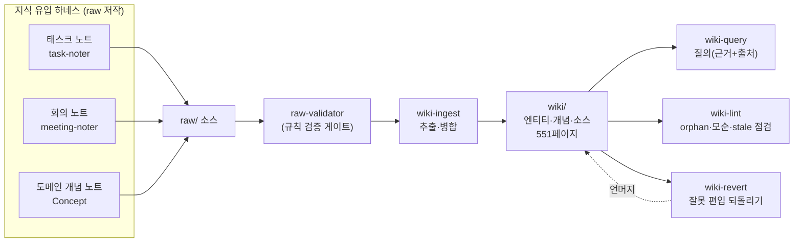

## TL;DR
- **무엇을**: 흩어진 개인·업무 노트(태스크·회의·도메인)를 LLM이 정제·연결한 **지식 베이스(wiki)** 로 자동 합치는 시스템을, Claude Code **하네스**(에이전트+스킬+스키마)로 구현한 사례다.
- **왜**: "노트를 잘 쓰는 것"과 "그 지식을 잘 꺼내 쓰는 것"은 다른 문제다. 소스가 쌓일수록 지식이 **복리로** 축적되게 만들기 위해서.
- **현재 상태**: raw 소스 → ingest → **wiki 551페이지**(엔티티 209·개념 163·소스 179)로 성장. 스킬 11·에이전트 10, 지식 유입·정제·질의·유지 파이프라인 가동 중.
- 바쁘면 **§1 문제 → §3 그림 → §4 우리 사례**만 봐도 전체 그림이 잡힌다.

## 1. 왜 만들었나 — 문제의식

일하면서 노트는 계속 쌓인다. 태스크 분석, 회의록, 도메인 정리, 코드 패턴… 그런데:

- **같은 주제가 여러 문서에 흩어진다** — `gncp-iris`·`가용재고`·`추가상품` 얘기가 태스크 14개·회의 7개·개념 노트 곳곳에 조각으로 존재
- **"X에 대해 아는 걸 다 모아줘"가 안 된다** — 파일을 하나씩 열어봐야 함
- **중복·모순이 방치된다** — 같은 개념을 문서마다 다르게 서술

> **한 줄 문제**
> **노트를 잘 쓰는 것 ≠ 그 지식을 잘 꺼내 쓰는 것.** 이 간극을 메우는 게 목표다.

## 2. 핵심 개념: llm-wiki

### 2-1. 패턴
Andrej Karpathy가 제안한 지식 베이스 패턴. **원천 문서를 잘게 검색(RAG)하는 대신, LLM이 수집 시점에 정제·중복제거·상호연결된 "완결된 페이지"로 컴파일**해두고 그걸 참조한다.

```
raw/ (원천·불변)  ──ingest──▶  wiki/ (LLM 생성물)      ◀──query── 질문
사용자가 쌓는 노트              엔티티·개념·소스 1페이지씩
                              정제·중복제거·상호링크·출처인용
```

> **RAG와 뭐가 다른가**
> | | 일반 RAG | llm-wiki |
> |---|---|---|
> | 검색 대상 | 원본을 쪼갠 **임베딩 청크** | 미리 정제한 **완결 페이지** |
> | 정제 시점 | 질문할 때(즉석 조합) | **수집할 때 미리** |
> | 탐색 | 벡터 유사도 | index→페이지→링크(구조 탐색) |
> | 결과 | 노이즈·중복 있음 | 중복제거·출처추적·모순보존 |
>
> → 비용을 "질문 시점"에서 "수집 시점"으로 옮긴 것. **경계 있는 도메인 지식**에 유리.

### 2-2. 구성요소
llm-wiki는 뚜렷한 조각들로 이뤄진다. 각 요소가 하는 일은 다음과 같다.

**① 레이어 — raw / wiki / infra + 스키마**

| 레이어 | 경로 | 역할 |
|---|---|---|
| **raw** | `raw/` | 진실의 원천 — 사용자가 쓰는 노트. **불변(읽기 전용)**: wiki가 틀리면 원본이 아니라 wiki를 다시 만든다 |
| **wiki** | `wiki/` | LLM 생성물 — 정제·연결된 지식 페이지 |
| **infra** | `infra/` | 옵시디언 설정·산출물 (ingest 제외) |
| **스키마** | `AGENTS.md` | wiki를 어떻게 생성·병합·유지할지 규칙(단일 진실 공급원) |

**② wiki 페이지 3종 — llm-wiki의 산출물**
- **엔티티(entity)**: 고유명사 — 인물·조직·프로젝트·제품·시스템. 예: gncp-iris·`네이버-배송`
- **개념(concept)**: 도메인 용어·이론·방법. 예: `가용재고`·`추가상품`·`rmid`
- **소스(source)**: 원본 하나당 요약 페이지. 어느 원본에서 무엇이 나왔는지 추적 + `contentHash`로 변경 감지 → **되돌리기(revert)의 근거**
- 페이지끼리 `양방향 링크`로 이어져 **지식 그래프**를 이룬다

**③ 카탈로그·기록 — index.md / log.md**
- `index.md`: 전체 엔티티·개념 목록 + aliases. 질의 시 방대한 wiki 중 **어디를 열지 먼저 정하는 진입점**(컨텍스트 라우터). 매 작업마다 갱신
- `log.md`: 모든 수집·질의·점검·되돌리기를 append-only로 기록 — "언제 무엇이 왜 편입/제거됐나" 감사 추적

**④ 오퍼레이션 4종 — 지식의 생애주기**
- **ingest(수집)**: 원본 읽기 → 엔티티·개념·모순 추출 → 페이지 생성/병합. **복사가 아니라 병합**(append-only) — 같은 개념은 여러 소스가 한 페이지에 누적된다
- **query(질의)**: index→페이지→링크로 구조 탐색해 답 + `출처`. 없으면 "wiki에 없음"이라고 정직하게
- **lint(점검)**: orphan(고립)·stale(90일 미갱신)·깨진 링크·모순·태그 위반을 점검
- **revert(되돌리기)**: 잘못 편입되거나 원본이 이동·삭제됐을 때, 그 소스의 기여분만 언머지

**⑤ 품질 장치 — 신뢰성을 지키는 규칙**
- **append-only 병합**(덮어쓰기 금지) · **verbatim 인용**(출처를 원문 그대로 — 되돌리기·검증의 근거) · **모순 보존**(소스 간 충돌은 숨기지 않고 `## 모순`에 양측 보존) · **contentHash**(본문 안 바뀌면 재수집 시 즉시 skip)

## 3. 아키텍처 & 구현

### 3-1. 파이프라인



### 3-2. 구현 — 어느 스킬·에이전트가 하나

각 오퍼레이션을 **스킬(어떻게) + 전문 에이전트(누가)** 로 분리해, 반복·재사용 가능하고 다음 세션에서도 자동 트리거되게 했다(=하네스로 구현).

| 오퍼레이션 | 스킬 | 에이전트 |
|---|---|---|
| 저작·검증(수집 전 게이트) | `raw-authoring` | `raw-validator` |
| 수집(ingest) | `wiki-ingest` | `wiki-ingest` |
| 질의(query) | `wiki-query` | `wiki-query` |
| 점검(lint) | `wiki-lint` | `wiki-lint` |
| 되돌리기(revert) | `wiki-revert` | `wiki-revert` |
| 전체 오케스트레이션 | `llm-wiki` | — |

- 정의 위치: 스킬 `.claude/skills/` · 에이전트 `.claude/agents/` · 스키마 `AGENTS.md`

## 4. 우리 사례 — 지식이 실제로 어떻게 도는가

llm-wiki 위에, **지식을 만들어 넣는 하네스**들을 함께 붙였다. 이들이 raw 소스를 생산 → llm-wiki가 wiki로 정제한다.

| 유입 하네스 | 무엇을 | 현재 |
|---|---|---|
| **Task-Note** | JIRA·OSS·PR·리뷰를 모아 태스크 노트로 | 14건 |
| **Meeting-Note** | 회의 녹음·전사 → 회의 노트 (+ Works 캘린더로 참석자 융합) | 7건 |
| **Concept(도메인 개념)** | 에픽/문서에서 도메인 개념을 개별 문서로 (지식 로그로 누적) | 10건 |

### 예시 흐름 — 회의 하나가 지식이 되기까지
1. 로컬 녹음 → 전사(`transcript.txt`) 생성
2. `meeting-noter`가 회의 노트로 정제, **Works 캘린더와 융합**해 참석자·일시 보완
3. `wiki-ingest`가 회의 노트를 wiki로 편입 → 기존 개념 페이지(`멤버십-새벽배송`·`rmid` 등)에 **병합**
4. 나중에 그 주제를 물으면 `wiki-query`가 **연결된 지식 페이지 + 출처**로 답

> **Before → After**
> **Before**: `가용재고` 지식이 태스크 3개 + 회의 1개 + 개념 노트에 흩어짐 → 다 열어봐야 함
> **After**: `wiki/concepts/가용재고.md` 한 장에 정의·특징·코드표현(`ld_prod_avl_invn` SP-prefix)·출처가 누적 → 한 번에 파악

### 파생 산출물
- **Task-Manage 대시보드**: 같은 태스크 노트를 원천으로 과제별 진행·일정을 보는 로컬 웹 대시보드(별도 하네스, 읽기 전용)

## 5. 이렇게 쓴다

- **질의**: "gncp-iris 가용재고 어떻게 도나" → wiki 근거로 답 + `출처 페이지` 명시. 없으면 "wiki에 없음"이라고 정직하게.
- **유지**: 수집 후 `wiki-lint`로 orphan(고립)·모순·깨진 링크·stale(90일 미갱신)을 점검
- **되돌리기**: 잘못 편입/문서 이동 시 `wiki-revert`로 그 소스 기여분만 언머지 → 재수집
- **모순은 숨기지 않는다**: 소스 간 충돌은 `## 모순`에 양측 보존 (예: 방안 선호순서 상충)

## 6. 효과와 한계

**효과**
- 크로스소스 종합 — 소스가 늘수록 페이지가 두꺼워짐(복리)
- 출처 추적·모순 보존·값싼 재수집(해시 비교)
- 질의 시 **내 맥락에 맞는 답**(사내 도메인) — 웹/일반지식보다 정확

**한계 / 적합 조건**
- **경계 있는 도메인 + 수백 소스 규모**에 적합 (우리 케이스가 여기)
- 대규모·실시간·비정형 코퍼스엔 여전히 RAG가 맞음
- 정제(ingest)에 선불 비용이 든다 — 안 겹치는 소수 문서엔 과함

## 7. 더 알아보기

- **Karpathy LLM Wiki (원본 gist)**: <https://gist.github.com/karpathy/442a6bf555914893e9891c11519de94f>
- **스키마**: 이 볼트 `AGENTS.md` (wiki 페이지 구조·병합·유지 규칙)
- **하네스 정의**: `.claude/skills/`(스킬) · `.claude/agents/`(에이전트)
- 관심 있으면 최소 구성(raw/wiki/infra 3폴더 + `AGENTS.md` 스키마 + Claude Code)으로 시작 가능 — 자세한 셋업은 별도 공유

> **공유 시 주의**
> 이 시스템은 **사내 JIRA/OSS·회의·도메인 데이터**를 담는다. 산출물(wiki·대시보드)은 **로컬/사내 전용**으로 다루고, 공개 블로그 등 외부 공개는 하지 않는다.

---

*헤더 이미지: Bernd 📷 Dittrich / Unsplash (Unsplash License) — [출처](https://unsplash.com/photos/a-white-board-with-writing-written-on-it-1xE5QnNXJH0)*
